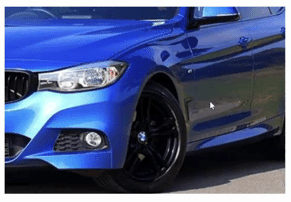

# zoomify

A [JS](https://github.com/mdrajibul/zoomify) library to zoomify background image.

## Installation

```bash
# using npm
npm install @mdrajibul/zoomify
```

## Usage

### For nodeJs application

```html
<div style="width:300px;width:400px">
    <div id="bgImage" style="background-position: center top;background-size: cover;background-image: url(https://sb.kaleidousercontent.com/800x533/fe745b9915/cars.jpg);">
</div>
```

```js

import { Zoomify } from '@mdrajibul/zoomify'

Zoomify.run(document.getElementById('bgImage'));

or 

const zoomify = new Zoomify(document.getElementById('bgImage'));
zoomify.start();

```


### For browser application

```html

<script src="./zoomify/umd/zoomify.js" type="text/javascript"></script>

<div style="width:300px;width:400px">
    <div id="bgImage" style="background-position: center top;background-size: cover;background-image: url(https://sb.kaleidousercontent.com/800x533/fe745b9915/cars.jpg);">
</div>

<script>
  document.addEventListener(
      'DOMContentLoaded',
      function() {
          Zoomify.run(document.getElementById('bgImage'));

           //OR

          const zoomify = new Zoomify(document.getElementById('bgImage'));
          zoomify.start();

      },
      false
  );
</script>

```

### Options
Below are the contructor params

<ul>
  <li><b>container</b>: A html element</li>
  <li><b>autoStop</b>: Set true to stop automatically when use mouse out and false to control from outside</li>
</ul>

### Functions

- <b>run</b> : Static method to run zoomify to auto start and auto stop when mouvemove and mouseout
- <b>init</b>: Initialize without start. Useful when control image zoom from outside handler
- <b>start</b>: After initialize user should call start manually. Useful when control image zoom from outside handler
- <b>stop</b>: Use to stop zoomify. Useful when control reset image zoom from outside handler

## Demo


